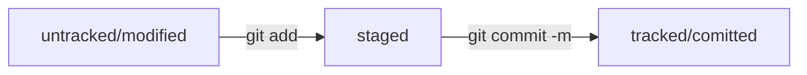

# Список основных команд GIT

---

- ```git init``` - инициализировать локальный гит-репозиторий в текущей папке
- ```git clone url_репозитория``` - склонировать удаленный репозиторий и связать с локальным
- ```git status``` - проверка состояния локального репозитория (новые/измененные файлы)
- ```git add название_файла_или_.``` - добавить файлы в кэш гита (```.``` - добавить все файлы)
- ```git commit -m "Текст коммита"``` - сделать коммит текущего состояния папок и файлов
- ```git push``` - отправка изменений в удаленный репозиторий


## Хеш
Идентифицирует коммит. Зная хеш коммита можно редактировать или удалить коммит.

## Лог
Команда ```git log``` выводит информацию о коммитах.

# HEAD
Это файл в папке ```.git```, который указывает на файл, в котором хранится хеш на последний коммит.

# Статусы файлов


